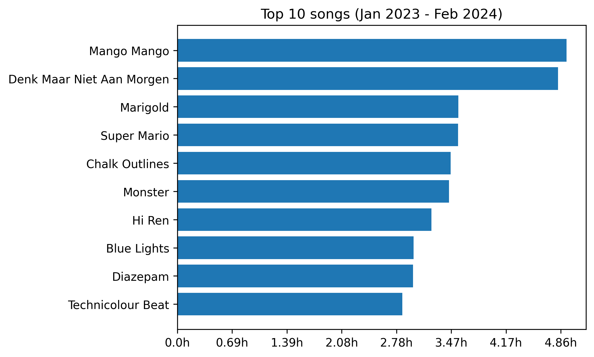
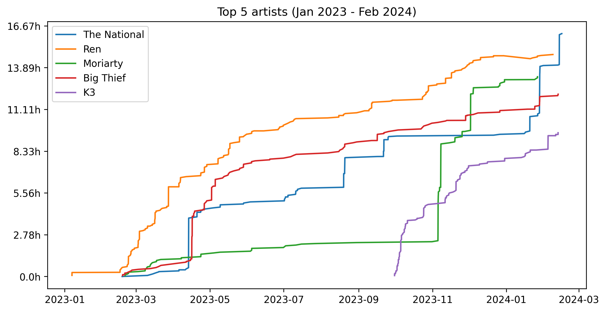

# Spotify Grapher

## 📖 Description

A tiny Python script that generates visualizations of your Spotify streaming history, made so I can practice working with Pandas data frames. :)

Go to your Spotify account and request your data. After a few days, you'll get a zip file from them with a bunch of JSON files, containing your streaming history of the past year. This script will generate a couple of graphs from that zip file. The entire lifetime streaming history will take longer to receive (around 30 working days or so).

Features:

- Generate a bar chart of the top 10 songs played.
- Generate a line chart of the listening history for the top 5 artists.
- More coming soon :D (still waiting for lifetime streaming history from Spotify)

## 👩‍💻 Usage

To run the script and generate your own graphs, you can just copy the zip you get from Spotify into this project's directory (it will be called 'my_spotify_data.zip') then execute:

```

python main.py

```

The outout will be two graphs which will be saved as `top_10_songs.png` and `top_5_artists.png`.

## 📂 Project background
This is my first personal project after starting to learn Python.

The project is inspired by [Eric Chiang's inquiry](https://ericchiang.github.io/post/spotify/) into his own streaming history.

Eric had access to his entire Spotify streaming history. I'm still waiting for mine (it takes up to 30 days) but meanwhile I got a small data set from Spotify, covering only the past year and a subset of info. 16,490 events iso the 120,000 Eric had.

## Visuals 

The two most listened songs of the past year (by quite a margin) are actually our toddler's favourite songs. :D 




Our toddler is three, he started preschool last September. A few weeks in, he already started having a say in what I listen to.. (spot the purple line) coming in strong at number 5. Before September 2023, nobody in our family had ever heard of K3, now they're one of our most listened to bands.




---

Thanks for visiting my project page!

Connect with me on [LinkedIn](https://www.linkedin.com/in/mirunasuru/) 

🤍
